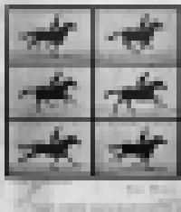

The Wikidata Analytics dashboards rely on many publicly available datasets that are produced and updated by our back-end ETL and ML systems. Here we present a selection of them. All of the following and many more datasets, are available from [our public data repository](https://analytics.wikimedia.org/published/datasets/wmde-analytics-engineering/).

------

**Human vs Bot Wikidata Edits**

[Download](https://analytics.wikimedia.org/published/datasets/wmde-analytics-engineering/Wikidata/WD_HumanEdits/WD_HumanEdits.csv)

Lists the Wikidata classes in `wd_class` and reports on (1) their `label`, (2)	`num_items` - the number of items (by direct P31 links), (3)	`human_edited_items` - the number of items ever edited by human editors,	(4) `percent_items_touched` - the number of items ever edited by a human editor, (5)	`median_unique_editors` - the median number of unique editors per item in the respective class, (6)	`human_edits` - the number of edits made by human editors in the respective class, (7) `bot_edits` - the number of edits made by bots in the respective class, (8) `total_edits` - the total edits count in the respective class, (8)	`human_to_bot_ratio` - the ratio of human to bot edits, (9) `human_percent` - the % of edits made on behalf of human editors in the respective class, (10) `bot_percent` - the % of edits made on behalf of bots in the respective class. 

------

**Usage and Coverage Statistics**

[Download](https://analytics.wikimedia.org/published/datasets/wmde-analytics-engineering/Wikidata/WD_percentUsage/wdUsage_ProjectStatistics.csv)

Statistics on Wikidata reuse across the WMF websites. Fields: (1) `project` - a particular WMF website, (2) `numPages` - the total number of pages in this project (definition: namespace = 0, no redirects), (3) `wdUsePages` - the number of pages making any use of Wikidata, (4) `wdSitelinksPages` - the number of pages with Sitelinks, (5)	`percentWDuse` - the % of pages using Wikidata, (6)	`percentWDsitelinks` - the % of pages with Sitelinks, (7)	`projectType` - the type of WMF project (e.g. Wikipedia, Wiktionary, Wikivoyage, etc). 

------

**Label Statistics**

[Download Labels](https://analytics.wikimedia.org/published/datasets/wmde-analytics-engineering/Wikidata/wd_datamodel_terms/DM_Terms_Labels.csv) | [Download Aliases](https://analytics.wikimedia.org/published/datasets/wmde-analytics-engineering/Wikidata/wd_datamodel_terms/DM_Terms_Aliases.csv) | [Download Descriptions](https://analytics.wikimedia.org/published/datasets/wmde-analytics-engineering/Wikidata/wd_datamodel_terms/DM_Terms_Descriptions.csv)

How many item labels, aliases, and descriptions, per language? 

------

**Languages Ontology Overview**

[Download](https://analytics.wikimedia.org/published/datasets/wmde-analytics-engineering/Wikidata/WD_Languages_Landscape/WD_Languages_OntologyStructure.csv)

A tabular, relational representation of the important class relationships among the languages represented in Wikidata. Fields: (1) `item` - a `Q` identifier of a particular language, (2) `itemLabel` - English label for the respective language, (3)	`superClass` - a `Q` identifier for the class encompassing the respective language, (4)	`superClassLabel` - the respective's class English label, (5)	`relation` - the relation connecting the language and the class.

------

**Language Reuse and Status**

[Download](https://analytics.wikimedia.org/published/datasets/wmde-analytics-engineering/Wikidata/WD_Languages_Landscape/WD_Languages_UsedLanguages.csv)

Important statistics on the language reuse and status. Reuse statistics are [WDCM usage statistics](https://wikitech.wikimedia.org/wiki/Wikidata_Concepts_Monitor#[AN_IMPORTANT]_NOTE_on_the_Wikidata_usage_definition). Fields: (1) `language` - the ISO 639-1 language code, (2)	`reuse` - the total reuse (across all WMF websites) of items that have a label in this language, (3) `item_count` - the number of items with a label in this language, (4)	`num_items_reused` - the number of items with a label in this language that are also reused across the WMF projects, (5)	`languageURI` - the `Q` identifier for this language, (6)	`description` - the English label for this language, (7)	`EthnologueLanguageCode` - the Ethnologue database code for this language, (8) 	`EthnologueLanguageStatus` - the status of this language per Ethnologue, (9)	`UNESCOLanguageStatus` - the status of this language per UNESCO, (10)	`numSitelinks` - number of Sitelinks for this language, i.e. how many Wikipedia pages there exist for it.

------

**External Identifiers Reuse**

[Download](https://analytics.wikimedia.org/published/datasets/wmde-analytics-engineering/Wikidata/WD_External_Identifiers/WD_ExternalIdentifiers_Usage.csv)

An overview of the [Wikidata External Identifiers](https://www.wikidata.org/wiki/Wikidata:External_identifiers). Fields: (1) `property` - a `Q` identifier for a particular external identifier, (2) `usage` - how many Wikidata items are described by this external identifier,  (3) `label` - English label for this identifier, (4) `class` - a class of identifiers to which it belongs, (5) `classLabel` - English label for this class.

------

**External Identifiers Overlap (Co-Occurence) Matrix**

[Download](https://analytics.wikimedia.org/published/datasets/wmde-analytics-engineering/Wikidata/WD_External_Identifiers/WD_ExternalIdentifiers_Co-Occurence.csv)

An identifier × identifier symmetric matrix. Each entry represents the number of items that are described by both the identifier found in the respective row and the identifier found in the respective column. Useful for similarity computations across identifiers.

------

**External Identifiers Jaccard Distance Matrix**

[Download](https://analytics.wikimedia.org/published/datasets/wmde-analytics-engineering/Wikidata/WD_External_Identifiers/WD_ExternalIdentifiers_JaccardDistance.csv)

An identifier × identifier [Jaccard distance](https://en.wikipedia.org/wiki/Jaccard_index) matrix, computed from [External Identifiers Overlap (Co-Occurence) Matrix](https://analytics.wikimedia.org/published/datasets/wmde-analytics-engineering/Wikidata/WD_External_Identifiers/WD_ExternalIdentifiers_Co-Occurence.csv) dataset.

------

**The top 100,000 most popular Wikidata items**

[Download](https://analytics.wikimedia.org/published/datasets/wmde-analytics-engineering/wdcm/etl/wdcm_topItems.csv)

A list of `Q` identifiers for the top 100,000 most widely reused Wikidata items in the WMF universe. The reuse statistic is, of course, the [WDCM usage statistic](https://wikitech.wikimedia.org/wiki/Wikidata_Concepts_Monitor#[AN_IMPORTANT]_NOTE_on_the_Wikidata_usage_definition).

------

**The top 10,000 most popular Wikidata items per WDCM taxonomy classes**

[Download](https://analytics.wikimedia.org/published/datasets/wmde-analytics-engineering/wdcm/etl/wdcm_category_item.csv)

The [Wikidata Concepts Monitor (WDCM)](https://wikitech.wikimedia.org/wiki/Wikidata_Concepts_Monitor), our system that tracks and analyzes the Wikidata items reuse across the WMF universe, does not track the whole of Wikidata, but rather a selection of categories that fall close the some intuitive human semantics: Human	(Q5), Wikimedia_Internal	(Q4167836, Q4167410, Q11266439), Work Of Art	(Q838948), Book	(Q571), Geographical Object	(Q618123), Organization	(Q783794, Q988108, Q43229), Architectural Structure	(Q4989906, Q41176), Gene	(Q7187), Chemical Entities	(Q11344, Q11173, Q79529), Astronomical Object	(Q6999), Taxon	(Q16521), Event	(Q1656682), Thoroughfare	(Q83620). This dataset lists `Q` identifiers, English labels, reuse statistics (the `eu_count` field), and WDCM category for the top 10,000 reused items from each of these categories.

------

**Wikidata reuse in WMF projects**

[Download](https://analytics.wikimedia.org/published/datasets/wmde-analytics-engineering/wdcm/etl/wdcm_project.csv)

This dataset lists all WMF projects that reuse Wikidata and the respective total reuse statistics. **NOTE.** The [Wikidata Concepts Monitor (WDCM)](https://wikitech.wikimedia.org/wiki/Wikidata_Concepts_Monitor), our system that tracks and analyzes the Wikidata items reuse across the WMF universe, does not track the whole of Wikidata, but rather a selection of categories that fall close the some intuitive human semantics: Human	(Q5), Wikimedia_Internal	(Q4167836, Q4167410, Q11266439), Work Of Art	(Q838948), Book	(Q571), Geographical Object	(Q618123), Organization	(Q783794, Q988108, Q43229), Architectural Structure	(Q4989906, Q41176), Gene	(Q7187), Chemical Entities	(Q11344, Q11173, Q79529), Astronomical Object	(Q6999), Taxon	(Q16521), Event	(Q1656682), Thoroughfare	(Q83620).

------

**Wikidata Gender reuse in WMF projects**

[Download](https://analytics.wikimedia.org/published/datasets/wmde-analytics-engineering/wdcm/biases/genderProjectDataSet.csv)

The dataset considers the Wikidata items described as being [male (Q6581097)](https://www.wikidata.org/wiki/Q6581097)  or [female (Q6581072)](https://www.wikidata.org/wiki/Q6581072) by [sex or gender (P21)](https://www.wikidata.org/wiki/Property:P21) and looks into their [WDCM reuse statistics](https://wikitech.wikimedia.org/wiki/Wikidata_Concepts_Monitor#[AN_IMPORTANT]_NOTE_on_the_Wikidata_usage_definition) across the WMF websites. Fields: (1) `project` - a WMF projects, (2)	`usageM` - the total reuse of male items, 	(2) `usageF` - the total reuse of female items, (3)	`propM` - the reuse proportion of male items relative to female items, (4)	`propF` - the reuse proportion of female items relative to male items, (5) `percentM` - male reuse % derived from proportion, (6) `percentF` - female reuse % derived from proportion, (7) `projectType` - e.g. Wikipedia, Wikivoyage, Wiktionary, etc, (8) `pMF` - the posterior probability that male items are reused more than female items from a Bayesian proportions test, (9) `CI5` - the lower 5% bound of the credible interval, (10)	`CI95` the upper 95% bound of the credible interval.

------

**Wikidata Gender vs Occupation reuse in WMF projects**

[Download](https://analytics.wikimedia.org/published/datasets/wmde-analytics-engineering/wdcm/biases/occUsage.csv)

The dataset considers the Wikidata items described as being [male (Q6581097)](https://www.wikidata.org/wiki/Q6581097)  or [female (Q6581072)](https://www.wikidata.org/wiki/Q6581072) by [sex or gender (P21)](https://www.wikidata.org/wiki/Property:P21) and looks into their [WDCM reuse statistics](https://wikitech.wikimedia.org/wiki/Wikidata_Concepts_Monitor#[AN_IMPORTANT]_NOTE_on_the_Wikidata_usage_definition) across the WMF websites [occupation (P106)](https://www.wikidata.org/wiki/Property:P106). Fields: (1) `occupation` - an occupation, `Q` identifier, (2) English `label` of the respective occupation, (3)	`usageM` - the total reuse of male items with the respective occupation, 	(4) `usageF` - the total reuse of female items with the respective occupation, (5)	`totalUsage` - the total reuse of items with the respective occupation, (6) `pMF` - the posterior probability that male items are reused more than female items from a Bayesian proportions test, (7) `CI5` - the lower 5% bound of the credible interval, (8)	`CI95` the upper 95% bound of the credible interval.

------

**Wikidata GLAM+ classes - their geo-location and reuse statistics**

[Download](https://analytics.wikimedia.org/published/datasets/wmde-analytics-engineering/wdcm/geo/)

A list of `.csv` files for the following GLAM+ categories: Archive, Art Gallery, Botanical Garden, City, Country, Library, Museum, University, Zoological Garden; fiels: (1) `eu_entity_id` - the `Q` identifier of the item, (2) `label` - the English label of the item, (3) `lon` - longitude, (4) `lat` - latitude, (5) `eu_count` - the [WDCM reuse statistic](https://wikitech.wikimedia.org/wiki/Wikidata_Concepts_Monitor#[AN_IMPORTANT]_NOTE_on_the_Wikidata_usage_definition).

