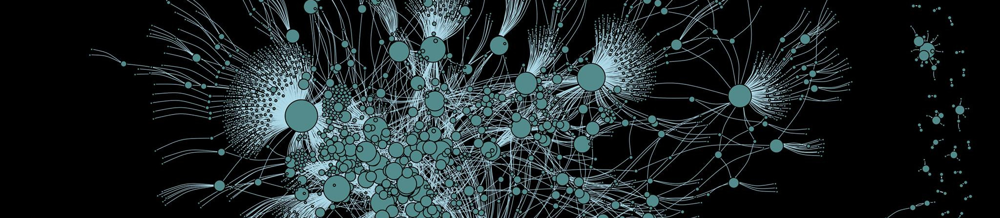

Welcome to the Wikidata Analytics portal!

WikidataCon 2019: Wikidata External Identifiers Similarity Graph 

This is the starting point to navigate a set of analytic systems that monitor the growth, usage, and structure of Wikidata.

The <b>Wikidata Concepts Monitor (WDCM)</b> system is a set of applications that monitor the re-use of Wikidata across the Wikimedia projects. All Wikimedia projects that maintain a [client-side usage tracking with Wikibase](https://www.mediawiki.org/wiki/Wikibase/Schema/wbc_entity_usage) provide data on how our items are used in the respective wikies. The WDCM system encompasses several dashboards that monitor and analyze such data by putting them in various perspectives, e.g. the type of re-use, the similarity structure across wikies and Wikidata items in respect to their co-usage patterns, biases in Wikidata re-use, geographical distribution, and more.

The <b>Analytics</b> menu will point to a number of dashboards that monitor various important Wikidata statistics, e.g. [the number of pageviews](https://wikidata-analytics.wmcloud.org/app/WD_pageviewsPerNamespace) it receives across different namespaces, the [ratio of human to bot edits](https://wikidata-analytics.wmcloud.org/app/WD_HumanEdits) across the Wikidata classes, the Wikidata [total reuse and coverage](https://wikidata-analytics.wmcloud.org/app/WD_percentUsageDashboard) in different Wikimedia projects, specific dashboards like the one that tracks the results of the Wikidata Reference Treasure Hunt Game, and similar.

The <b>Structural Systems</b> section points towards the most complex analytical systems that we currently maintain, the [Wikidata Languages Landscape](https://wikidata-analytics.wmcloud.org/app/WD_LanguagesLandscape) and the [Wikidata External Identifiers Landscape](https://wikidata-analytics.wmcloud.org/app/WD_ExternalIdentifiersDashboard). Both systems combine information on the re-use of Wikidata in Wikimedia projects with the structural, ontological patterns in some particular Wikidata classes (e.g. languages, external identifiers) and external datasets to provide in-depth understanding of the development of Wikidata in the respective domains. 

Some of the most interesting and important datasets that we produce and use in Wikidata Analytics are reviewed and provided for download in the <b>Datasets</b> section. The <b>Reports</b> section points to a selection of Wikidata analytic reports, e.g. the [Wikidata ORES Quality Report](https://wikidata-analytics.wmcloud.org/app_direct/WD_docs/Wikidata%20Quality%20Report.nb.html). More about our work can be found in the <b>Resources</b> and <b>About</b> sections.
